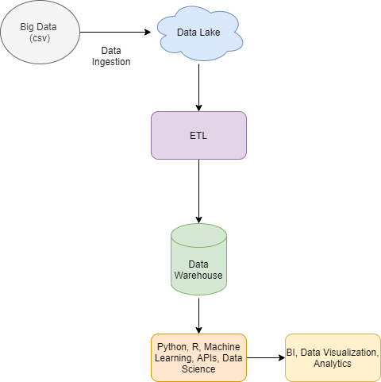

# Data Engineering Test
### Tech Used: Python and SQL 

## Introduction
I tried to develop a basic ETL process simulation: 
 - Using a csv file as a type of big data
 - Reading with python and pandas lib
 - Some data was with 'nan' at an id field, so this on my point of view can't happen, so I did a type of data handling with this
 - Loaded at a SQL relational database, simulating this as a Data Warehouse

## Using
#### To use this project you will need:
- Install mysql connector package
- Import pandas lib
- Create database and table as suggested on Database.sql file 
- I used PyCharm to develop this project

## Architecture idea: 

